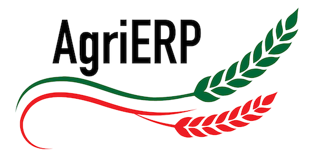
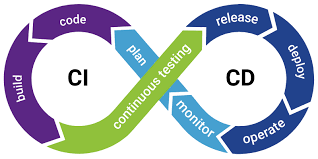

# AgriERP
**AgriERP - ERP per la gestione agricola a norma italiana**

## Che cos'è questo progetto
Questo progetto sperimentale (sperando possa avere il successo sperato) nasce con l'idea di
di fornire un piccolo ERP per le aziende agricole che non possono permettersi costi esorbitanti 
di software ma al contempo vogliono avere una gestione centralizzata delle informazioni senza
dover ricorrere a fogli di Excel o DB e maschere in Access.

Nasce come fork da Gazie, uno dei pochi ERP opensource che segue la legislazione italiana
, spartano, semplice e soprattutto maturo.

Gazie è un lavoro portato avanti da anni da Antonio de Vincentiis e tanti altri contributori
che si meritano tutti i crediti per l'impresa realizzata. Chapeaux!

## Cosa dovrebbe fare e cosa non dovrebbe fare
Mettiamo subito in chiaro che si sta concettualmente portando avanti l'idea di Gazie, con la stessa filofosia di libertà
di utilizzo ed uno sviluppo ulteriore su GitHUB.

### La lista delle cose che dovrebbe fare a livello di core è:
* Ciclo attivo
* Ciclo passivo
* Gestione lotti
* Magazzino
* Produzione di base
* Contabilità di base
* fatturazione elettronica in/out
* Quaderno di campagna e gestione agricola
* Gestione dei registri oleari del SIAN
* Tenuta del fascicolo aziendale e di tutti gli altri registri necessari
* Registri manutenzione macchine agricole e gasolio agricolo

### Mentre a livello modulare:
* Contabilità Analitica
* Agricoltura di precisione
* Gestione agricola avanzata (anche api e bestiame e non solo colture)
* Integrazioni con Google/Zapier/Etc
* Gestione dei progetti e dei progetti finanziati PSR
* Integrazione E-commerce
* SIAN per viticoltori e cantine

### Cosa non dovrebbe fare (almeno per ora):
* CRM
* Gestione commerciale dei contratti
* Booking vari (per agriturismi)

## Improvement tecnici e di progettazione
Come obbiettivo di miglioramento, aldilà di un aspetto grafico e di migliore usabilità,
si vuole modernizzare il ciclo di lavoro portandolo sullo stile DevOps un pò più standard ed un pò meno all'italiana...

Altre migliorie:
* Sviluppo e repo su GitHUB
* Issues e "cose da developer su GitHUB"
* Ticket, forum, assistenza utilizzatori su SF (meno dev e più human)
* Manuale e User Guide su ReadTheDocs

Maggiori info per sviluppatori, qui

Maggiori info per contributori che conoscono come funziona il settore ma non sono programmatori, qui 

## AAA Cercasi
Non sono/siamo una software house che investe milioni in R&D per commercializzare un software proprietario.

Quindi mi appello alla filosofia dell'opensource per cercare:

* Sviluppatori (ovviamente)
* Volontari con conoscenze economiche/fiscali/tributarie (siamo in Italia e solo voi ci potete salvare)
* Volontari con conoscenza agronomiche e/o normative su agricoltura e allevamento

## Licenza
AgriERP è distribuito sotto licenza GPL-3.0 e la documentazione sotto licenza Creative Commons (CC-BY-SA)